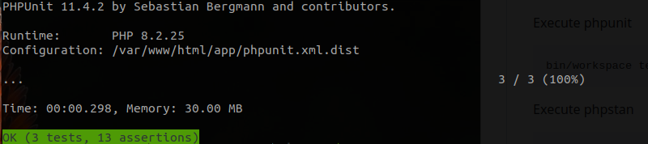
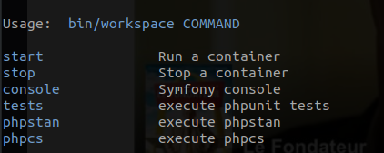
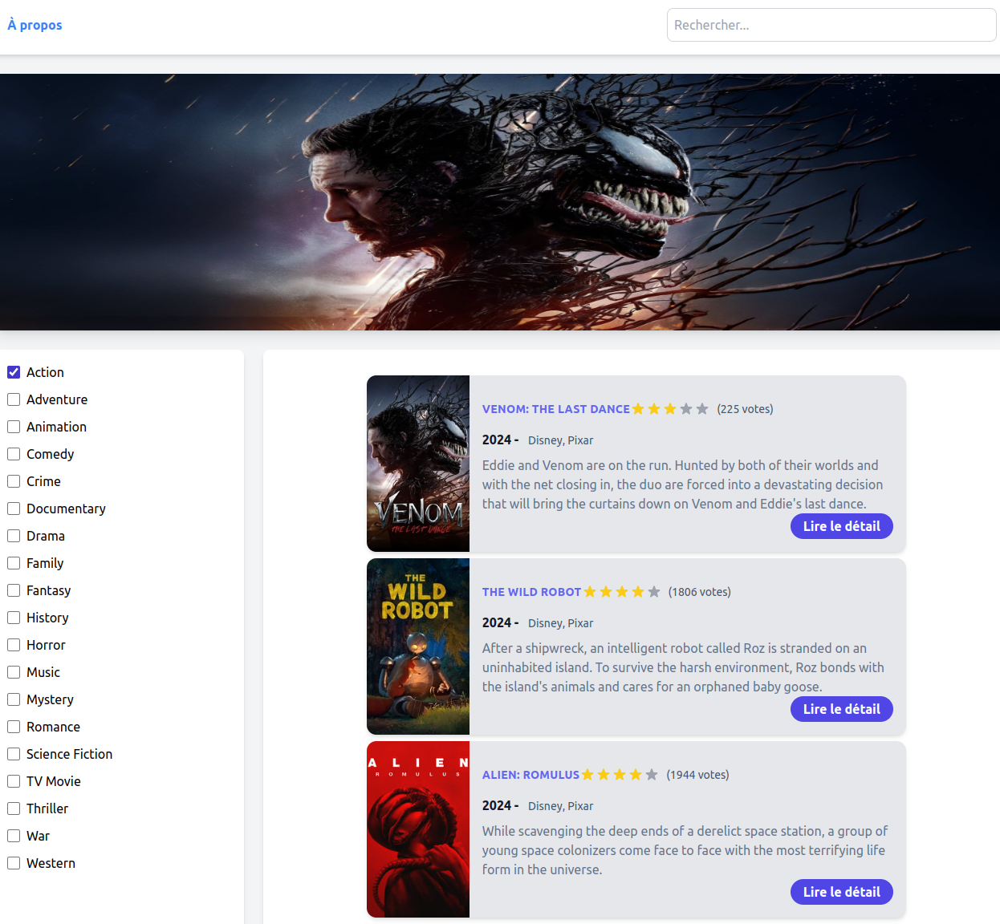
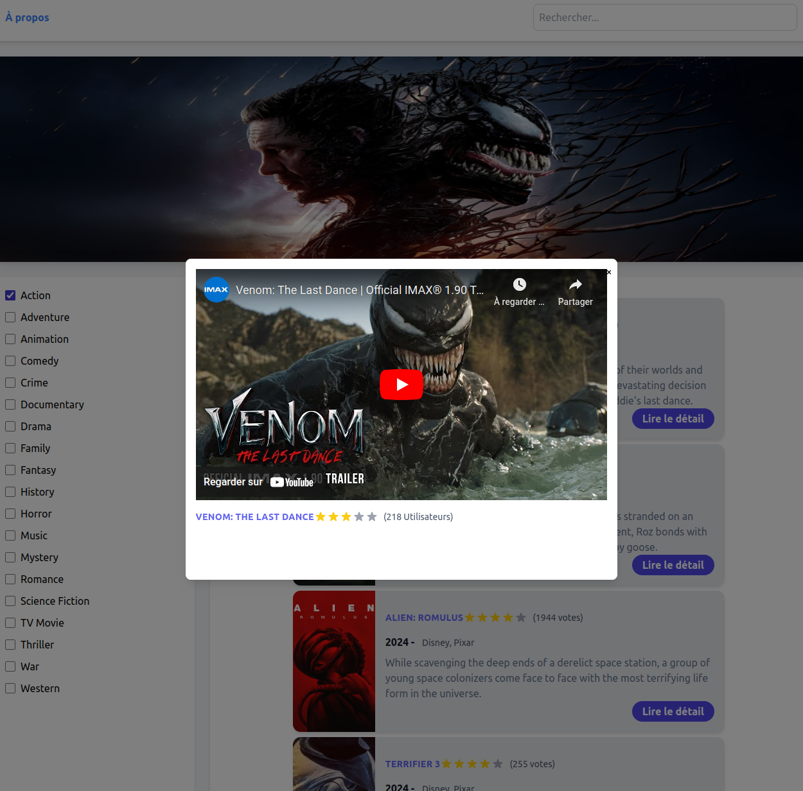

<h1> WeMovie </h1>

[](https://symfony.com/)
[](https://www.php.net/)


[](https://github.com/medalibs/WeMovies/actions/workflows/ci.yml)
[](https://github.com/medalibs/WeMovies/actions/workflows/phpstan.yml)
[](https://github.com/medalibs/WeMovies/actions/workflows/phpcs.yml)
[](https://github.com/medalibs/WeMovies/actions/workflows/phpunit.yml)


# Installation steps

Clone the project :

```
git clone git@github.com:medalibs/WeMovies.git
cd WeMovies/
```
Install dependencies & start docker and go to Home Page http://localhost:8080:

```
bin/workspace start
bin/workspace init
```

Stop docker

```
bin/workspace stop
```


Execute phpunit 
```
bin/workspace tests
```


Execute phpstan
```
bin/workspace phpstan
```

Execute phpcs
```
bin/workspace phpcs
```

To see all commands
```
bin/workspace
```



WebSite Screens




# Project architecture
````
├── app
│   ├── assets
│   │   ├── app.js
│   │   └── styles
│   │       ├── app.css
│   │       └── app.tailwind.css
│   ├── bin
│   │   ├── console
│   │   ├── phpunit
│   │   └── tailwindcss
│   ├── composer.json
│   ├── composer.lock
│   ├── config
│   │   ├── bundles.php
│   │   ├── packages
│   │   │   ├── asset_mapper.yaml
│   │   │   ├── cache.yaml
│   │   │   ├── framework.yaml
│   │   │   ├── routing.yaml
│   │   │   └── twig.yaml
│   │   ├── preload.php
│   │   ├── routes
│   │   │   └── framework.yaml
│   │   ├── routes.yaml
│   │   ├── services_test.yaml
│   │   └── services.yaml
│   ├── importmap.php
│   ├── phpunit.xml.dist
│   ├── public
│   │   └── index.php
│   ├── src
│   │   ├── Controller
│   │   │   ├── HomePageController.php
│   │   │   └── MovieDetailPageController.php
│   │   ├── Kernel.php
│   │   ├── Service
│   │   │   ├── MovieMockService.php
│   │   │   ├── MovieServiceInterface.php
│   │   │   └── TheMovieDBService.php
│   │   └── ValueObject
│   │       ├── Genre.php
│   │       ├── Movie.php
│   │       └── Trailer.php
│   ├── symfony.lock
│   ├── tailwind.config.js
│   ├── templates
│   │   ├── base.html.twig
│   │   ├── components
│   │   │   ├── card.html.twig
│   │   │   └── rating.html.twig
│   │   ├── layouts
│   │   │   ├── footer.html.twig
│   │   │   ├── header.html.twig
│   │   │   ├── hero_image.html.twig
│   │   │   ├── modal.html.twig
│   │   │   └── sidebar_genres.html.twig
│   │   └── pages
│   │       ├── about.html.twig
│   │       ├── home.html.twig
│   │       └── movie.html.twig
│   └── tests
│       ├── bootstrap.php
│       ├── Controller
│       │   └── HomePageControllerTest.php
│       └── Service
│           └── TheMovieDBServiceTest.php
├── bin
│   └── workspace
├── compose.yaml
├── docker
│   ├── nginx
│   │   └── nginx.conf
│   └── php
│       └── Dockerfile
└── README.md


````


